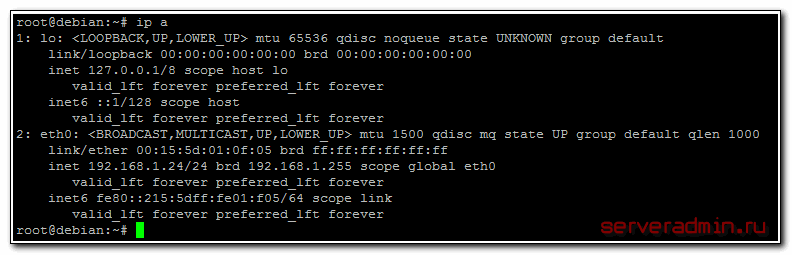
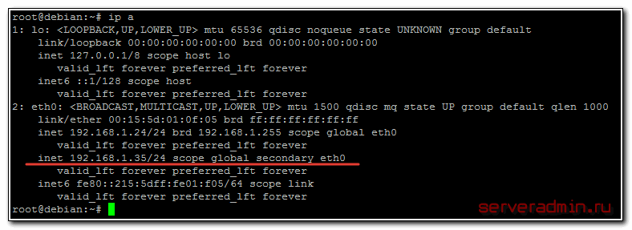

[На главную](../index.md)

https://serveradmin.ru/nastroyka-seti-v-debian/

Посмотреть адреса - `ip a`

## Настройка статического IP



Видим интерфейсы, например `eth0`
У меня в системе 1 сетевой интерфейс eth0 и он каким-то образом уже сконфигурирован. Назначим ему еще один статический адрес:

`ip addr add 192.168.1.35/24 dev eth0`

Этот адрес будет добавлен к уже существующему адресу. Проверим это:

`ip a`



Теперь сервер будет доступен по обоим адресам. Текущая настройка сохранится только до перезагрузки сервера. Чтобы она применялась во время загрузки, нужно либо каким-то образом добавить команду на изменение настроек в автозагрузку, например в /etc/rc.local, но это будет костыль. Правильнее отредактировать файл, который отвечает за сетевые настройки в debian - /etc/network/interfaces. Для того, чтобы назначить постоянный статический ip адрес, его нужно привести к следующему виду:

`mcedit /etc/network/interfaces`

```
source /etc/network/interfaces.d/*

auto lo
iface lo inet loopback

auto eth0
iface eth0 inet static
address 192.168.1.35
gateway 192.168.1.1
netmask 255.255.255.0
```

|  |  |
|----------|----------|
| auto    | eth0   |
| iface    | eth0 inet static   |
| address    | 192.168.1.35   |
| gateway    | 192.168.1.1   |
| netmask    | 255.255.255.0   |

Для проверки перезагружаем сервер и смотрим, все ли в порядке с настройкой статического ip адреса. Если вам нужно сменить ip адрес в debian, то вы можете временно изменить его с помощью команды ip, либо постоянно, отредактировав параметр **address** в файле сетевых настроек interfaces.

## Получение сетевых настроек по DHCP

`dhclient`
`ip a`

или для конкретного интерфейса

`dhclient eth0`
`dhclient -r`

## Установка шлюза по-умолчанию (default gateway)

`ip r sh` - узнать шлюз по умолчанию

Если нам нужно сменить default gateway, то сначала надо удалить текущий шлюз, а потом назначить новый.

```
ip route del default
ip route add default via 192.168.1.50
```

Если прописать `ip r sh`, то должны увидеть +- это:
```
default via 192.168.1.50 dev eth0
192.168.1.0/24 dev eth0 proto kernel scope link src 192.168.1.24
```