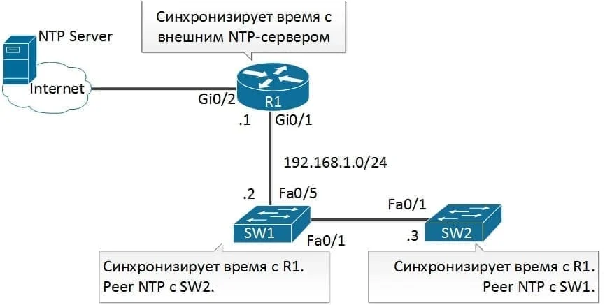

[На главную](../index.md)

https://blog.sedicomm.com/2021/03/25/kak-gramotno-nastroit-ntp-na-cisco-ios/

## Настройка NTP-сервера на маршрутизаторе

ntp master 2

## Настройка NTP на маршрутизаторах

`ntp server 10.10.10.1` - Настроить выгрузку времени с 10.10.10.1

Вы можете отслеживать этапы синхронизации командой show ntp associations - команда будет полезна для траблшутинга NTP;
show ntp status

У нас статус Clock is synchronized, stratum 2, reference is A.B.C.D. Значит все работает хорошо. Важно - настройка NTP, которую мы описали в статье, касается только софтового (программного) времени. Для того, чтобы синхронизировать хардварное (железное) время даем команду:

`ntp update-calendar` - синхронизировать софтовое и хардвардное время

## Настройка NTP на коммутаторах

Для того чтобы коммутатор смог отдавать проксировать NTP, необходимо прописать ему на порте VLAN1 IP Address

## Дополнительные настройки NTP на маршрутизаторе / коммутаторе Cisco (аутентификация)

Для обеспечения безопасности при работе протокола NTP можно настроить аутентификацию и ограничение доступа с помощью списков контроля доступа.

Шаги настройки аутентификации:

Шаг 1. Определите ключ / ключи аутентификации NTP с помощью команды ntp authentication-key.
Шаг 2. Включите аутентификацию NTP, используя команду ntp authenticate.
Шаг 3. Укажите, какой ключ будет действительным для аутентификации NTP, используя команду ntp trusted-key. Единственный аргумент этой команды — это ключ, который был определен на первом шаге.
Шаг 4. Укажите NTP-сервер, который требует аутентификацию, используя команду ntp server ip-address key key-number. Также аналогично можно аутентифицировать NTP-peer, используя команду ntp peer ip-address key key-number.

Для NTP можно настроить следующие четыре ограничения с помощью списков доступа:

Peer. Запросы на синхронизацию времени и запросы контроля разрешены. Устройству разрешено синхронизировать себя с удаленными системами, которые попадают в список доступа.
Serve. Запросы на синхронизацию времени и запросы контроля разрешены. Устройству не разрешено синхронизировать себя с удаленными системами, которые попадают в список доступа.
Serve-only. Позволяет только запросы синхронизации.
Query-only. Позволяет только контрольные запросы.

Шаг настройки списков доступа для NTP:

Шаг 1. Задать список доступа с указанием интересующей сети или устройства access-list [sequence] {permit | deny } source source-wildcard
Шаг 2. Применить настроенный список доступа к NTP с помощью команды ntp access-group {peer | query-only | serve | serve-only}